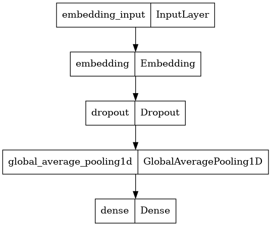

# Arabic Name Identification
Identifying Arabic names as correct or not using Tensorflow 2.

this repo is the solution for *Digified Junior Machine Learning Task*.

This repo included the following stages:
    1. Data Generation
    2. Training and evaluating different model
    3. Build a simple web server to serve the model
    4. Testing the web server and the model using `pytest`
    5. Containerizing the server into a docker image

## Data Generation
I needed to generate both correct and incorred 3-words arabic names.
- A correct name - `باسم وحيد السيد`.
- An incorrect name - `باسمم وحةد السد`.

### Using the provided names
The provided names included male and female names in a csv file.
so I generated names as follows.
#### Generating correct names
- 3 words
- First word can be male/female (50% 50%)
- Second and third words must be males

#### Generating incorrect names
- 3 words
- garbage words (shuffled correct names)
- mistyped (randomly repeated or removed characters from correct names)

#### Using online dataset
I found a dataset of student names [here](https://forums.madrsa-online.com/threads/3264/)
that included full names. I cleaned the data and generated my own list of names and generated correct names without the male/female part as I didn't have time to label the data.

#### Over engineered incorrect names
the generated incorrect names as instructed were enough if all the words in the name were mistyped but didn't behave right in the following cases:
- 1 or 2 of the words were correct .e.g. "زيادد عبدالرحمنت محمد"
- the name included correct words that were not names .e.g. "انه حقا زكى"

So I added to these methods to the incorrect names generation:
- included other correct words that are not names
- mixed all 3 methods
- mixed correct and incorrect names (at least one incorrect name).

using these methods when our models encountered one of the mensioned cases, it gave a more representative score.

## Training and Evaluation
I trained multiple versions of a base model and LSTM bidirectional model.
I tried multiple layer combinations, number of hidden units, dropout, etc.

### Base Model
#### The base model:


The base model had a high overall score, but it didn't perform well with incorrect names that had one correct word (name) in it.
it gave `انه حقا زكى ` a score of `97.1` which is far from correct.

#### LSTM Model


The LSTM model was the best overall performer.
The LSTM model gave `انه حقا زكى ` a score of `24.1` which is reasonable as it contains the word `زكى` which can be a name.

Finally I Saved the weights to use in my app. 


## The Interface and Deployment
- I created a simple REST API using **Flask**.
- and test the app using a simple HTTP request.
- I also created a testing script to test the following
  - The app is running
  - Get the result of multiple test samples
    - sample 1:  `معاذ طه عوض`
    - sample 2:  `باسم وحيد السيد`
    - sample 3:  `باسمم وحةد السد`
    - sample 4:  `شسي شسي شسي`
    - sample 5:  `مريم محمد محمد`
    - sample 6:  `زيادد عبدالرحمنت محمد`
    - sample 7:  `الكرة المصرية تفوز`
    - sample 8:  `انه حقا زكى`
    - sample 9:  `انه حقا مثابر`
    - sample 10:  `لا احب الكرة`
- I containerized the app using **Docker** and docker-compose.
Using a Tensorflow image as the starting image.

## Building the docker image and testing
```console
git clone https://github.com/moaaztaha/Arabic-Name-Identification.git
cd Arabic-Name-Identification
docker-compose up
```

After the image is running you can use `Test API.ipynb` to test it using your own examples.

or run `pytest -v` to use the predefined test examples.